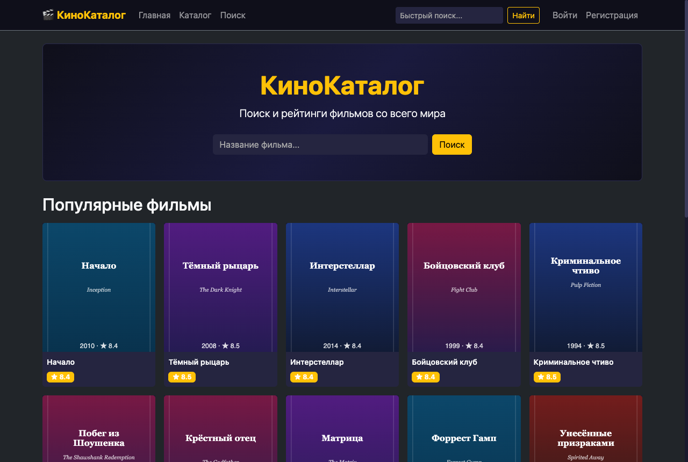
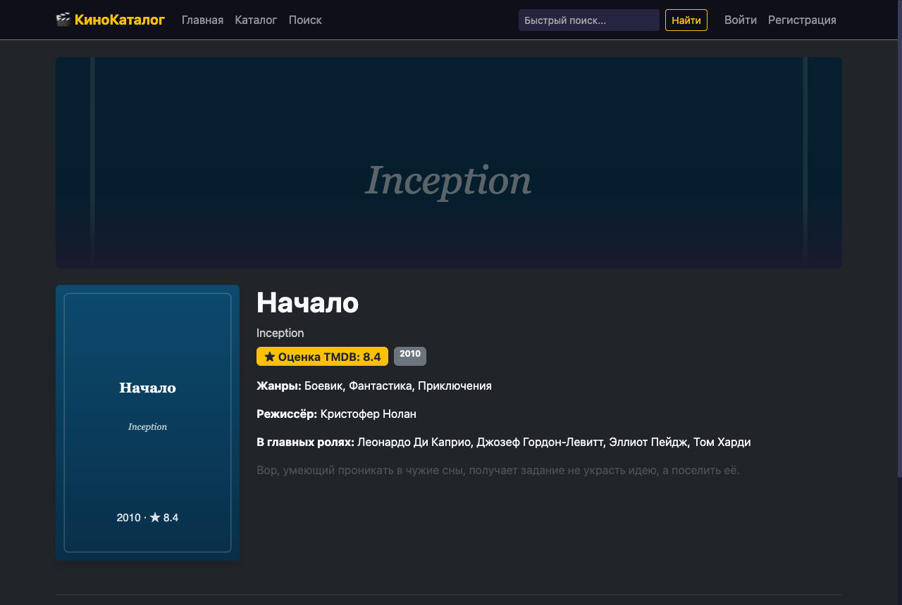

# Movie Catalogue

A server-rendered movie catalogue: browse, search, review and curate films, with an admin panel
for moderation. Built as a university practice project and since hardened into something that
runs anywhere with one command.

<p align="center">
  
</p>


[](https://github.com/SmesiteJl/moviecatalog/actions/workflows/ci.yml)

## Run it

```bash
docker compose up --build
```

Open <http://localhost:8080>. That is the whole setup — **no API key, no VPN, no database to create**.
The application ships with a bundled catalogue of 20 films and serves its own artwork, so a
reviewer sees a fully working site on a fresh clone.

Sign in as `admin` / `admin123` to reach the admin panel, or register a normal account.

> The demo administrator password is intentionally printed as a warning at startup. Set
> `ADMIN_PASSWORD` for any instance other people can reach.

### Using the live TMDB API instead

```bash
TMDB_MODE=http TMDB_API_KEY=<your key> docker compose up --build
```

If TMDB is unreachable from your network, set `TMDB_PROXY_ENABLED=true` with
`TMDB_PROXY_HOST` / `TMDB_PROXY_PORT`. See [.env.example](.env.example) for every setting.

## What it does

| | |
| :--- | :--- |
| **Catalogue** | Popular films, paginated; search by title, genre, actor or director |
| **Film page** | Poster, synopsis, rating, genres, cast, director, YouTube trailer when available |
| **Accounts** | Registration and form login on Spring Security, BCrypt-hashed passwords |
| **Personal** | Favourites and a personal profile |
| **Reviews** | One review per user per film, with an aggregate score |
| **Moderation** | Admin panel: block users, delete reviews, blacklist films |

<p align="center">
  
  <sub>Both screenshots are the default offline mode — no TMDB key, no network.</sub>
</p>

## How it is put together

Layered Spring MVC — controllers, services, Spring Data JPA repositories — rendered with Thymeleaf.
Two decisions are worth calling out:

**The movie source sits behind an interface.** `TmdbClient` has two implementations: `HttpTmdbClient`
calls the real TMDB API, `OfflineTmdbClient` serves a catalogue bundled into the jar. `MovieService`
cannot tell them apart. That seam is what lets the application boot with no credentials, and it is
also what makes the service layer testable without stubbing HTTP.

**Liquibase owns the schema, Hibernate only checks it.** `ddl-auto` is `validate`, never `update`, so
the schema can never drift silently at someone else's startup. `SchemaMigrationTest` starts the full
context against a real PostgreSQL: if a changelog and an entity disagree, the build fails rather
than the deployment.

```
src/main/java/com/example/moviecatalog/
├── client/      TmdbClient + HTTP and offline implementations
├── config/      Security, TMDB properties and wiring
├── controller/  Home, movies, search, auth, profile, admin
├── dto/         TMDB payloads
├── entity/      User, Movie, Review, Favorite, BlacklistMovie
├── repository/  Spring Data JPA
├── service/     Catalogue, favourites, reviews, users, moderation
└── web/         Artwork URL resolution
```

## Tests

```bash
mvn verify
```

47 tests. Unit tests cover the offline catalogue, the service layer (Mockito) and artwork URL
building. Integration tests run against **PostgreSQL 16 in Testcontainers** and cover the Liquibase
schema contract, the hand-written JPQL behind search, and the access rules separating guests, users
and administrators.

Requires Java 21 and a running Docker daemon. Build on JDK 21 specifically — no current Lombok
release supports JDK 26, and a failing Lombok processor shows up as hundreds of misleading
`cannot find symbol` errors in files you never touched.

## Configuration

Every setting has a working default; see [.env.example](.env.example).

| Variable | Default | Purpose |
| :--- | :--- | :--- |
| `TMDB_MODE` | `offline` | `offline` uses the bundled catalogue, `http` calls TMDB |
| `TMDB_API_KEY` | — | Required only when `TMDB_MODE=http` |
| `TMDB_PROXY_ENABLED` | `false` | Route TMDB calls through an HTTP proxy |
| `DB_HOST` / `DB_PORT` / `DB_NAME` | `localhost` / `5432` / `moviecatalog` | Database location |
| `DB_USER` / `DB_PASSWORD` | `moviecatalog` | Database credentials |
| `ADMIN_USERNAME` / `ADMIN_PASSWORD` | `admin` / `admin123` | Seeded administrator |

## Licence

[MIT](LICENSE)
